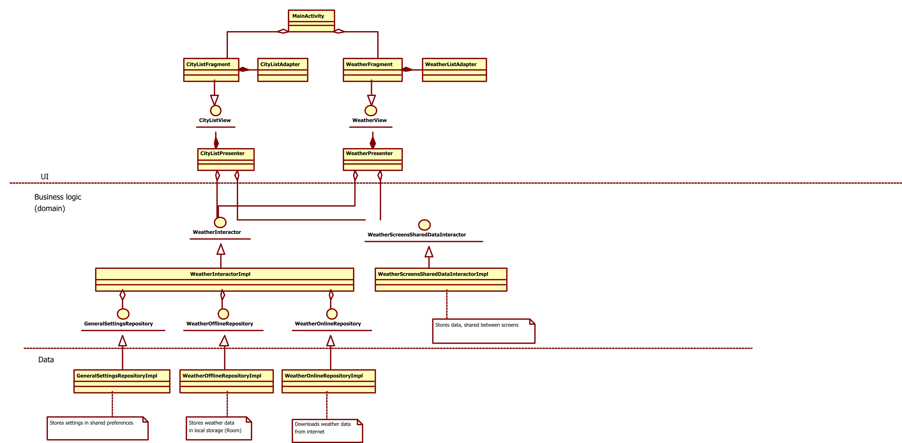

# Weather Forecast

Main used technologies/libraries: Kotlin coroutines, Dagger 2, Moxy, Retrofit, Room, Glide.

Unit testing: JUnit 5, Mockito Kotlin.

Main architecture concept: Clean Architecture (MVP for UI). 
See class diagram for details (only important classes are shown). 

For the local storage is used Room library. In the app used simplified database architecture: all data stored in 2 tables.
The city name is used as an index. In a real app with many data should be used integer index and tables should be joined by index. I think, for the task, it would be overhead.

Class diagram

 